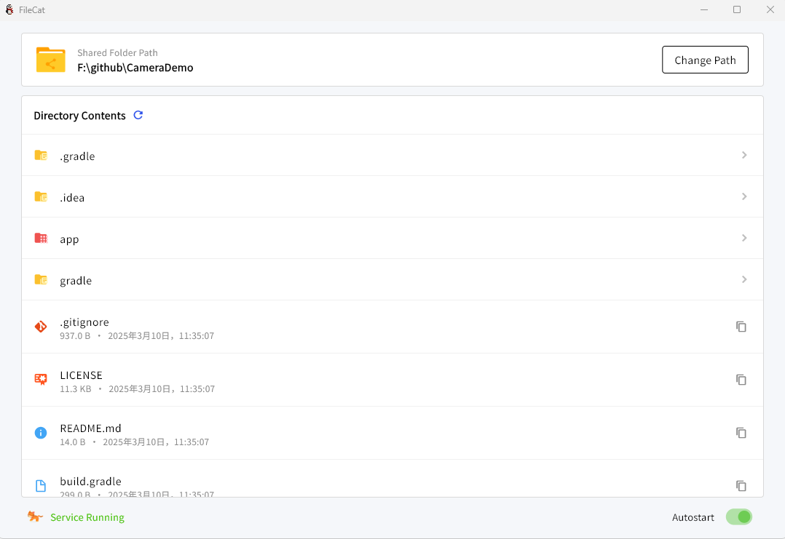

# filecat

File + Cat = filecat

[](https://github.com/ligbyte/filecat)


## Getting Started

```shell

cd rust; cargo clean;cargo build


flutter run -d windows
flutter run -d macos
flutter run -d linux
flutter run -d web
flutter run -d android
flutter run -d ios


```

# Flutter Web配置：

```
flutter config --enable-web
```

# Flutter Windows配置：

```
flutter config --enable-windows-desktop
https://visualstudio.microsoft.com/zh-hans/downloads/
```

# Flutter Mac配置：

```
flutter config --enable-macos-desktop
```

# Flutter Linux配置：

```
flutter config --enable-linux-desktop
```

flutter create .

空安全(nullsafe)迁移命令：

```
dart migrate --apply-changes
```

# 打包命令

```shell
先执行： cd rust; cargo clean;cargo build --release

flutter build apk --release
flutter build appbundle --release

flutter build ipa --release
flutter build ios --release

flutter build web --release

flutter build windows --release
flutter build macos --release
flutter build linux --release

```

C:\Users\dev>rustc --version
rustc 1.91.0 (f8297e351 2025-10-28)

Android Studio Ladybug | 2024.2.1 Patch 2
Build #AI-242.23339.11.2421.12550806, built on October 25, 2024
Runtime version: 21.0.3+-12282718-b509.11 amd64
VM: OpenJDK 64-Bit Server VM by JetBrains s.r.o.
Toolkit: sun.awt.windows.WToolkit
Windows 11.0
GC: G1 Young Generation, G1 Concurrent GC, G1 Old Generation
Memory: 4096M
Cores: 12
Registry:
i18n.locale=
Non-Bundled Plugins:
com.intellij.classic.ui (242.20224.159)
Statistic (5.0)
Dart (242.24931)
com.alibabacloud.intellij.cosy (2.10.1)
io.flutter (85.2.2)


按下 Win + R键打开“运行”对话框。
输入 firewall.cpl并按回车键，这将直接打开 Windows Defender 防火墙主界面。
